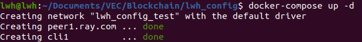

# Block chain database

This Block chain network is based on [Hyperledger Fabric](https://hyperledger-fabric.readthedocs.io/en/latest/whatis.html), the consequence node is on our GCP . The network is run in **docker container**, please install docker first. 

I have created TLC and MSP certificates for you. The profile is in on our github repository [VEC](https://github.com/Observe-l/VEC/tree/blockchain), you need download this file before connect to the network

Besides, I have upload some data on this network. You can check them when you connect to the network.

## 1. Install Fabric

This part refer to [Getting Start - Install](https://hyperledger-fabric.readthedocs.io/en/latest/getting_started.html)

### 1.1 Prerequisites

#### Git

Install the latest version of git

```shell
sudo apt-get install git
```

#### cURL

install the latest version of cURL

```shell
sudo apt-get install curl
```

#### Docker

Set up the respository

```shell
sudo apt-get update && sudo apt-get upgrade
sudo apt-get install \peer channel create -c vec-channel -f ./channel-artifacts/channel.tx --orderer orderer.gcp.com:7050 --tls true --cafile "$ORDERER_CA"
    ca-certificates \
    curl \
    gnupg \
    lsb-release
```

Add Docker’s official GPG key:

```shell
curl -fsSL https://download.docker.com/linux/ubuntu/gpg | sudo gpg --dearmor -o /usr/share/keyrings/docker-archive-keyring.gpg
```

Use the following command to set up the **stable** repository

```shell
echo \
  "deb [arch=$(dpkg --print-architecture) signed-by=/usr/share/keyrings/docker-archive-keyring.gpg] https://download.docker.com/linux/ubuntu \
  $(lsb_release -cs) stable" | sudo tee /etc/apt/sources.list.d/docker.list > /dev/null
```

Install Docker Engine

```shell
sudo apt-get update
sudo apt-get install docker-ce docker-ce-cli containerd.io
```

Once installed, check your docker version

```shell
$ docker --version

Docker version 20.10.12, build e91ed57
```

#### Docker Compose

Install the docker compose

```shell
sudo apt-get install docker-compose
```

Check your docker-compose version

```shell
$ docker-compose --version

docker-compose version 1.25.0, build unknown
```

Add your user to the Docker group. **Remember replace the  username**

```shell
sudo usermod -a -G docker username
```

#### Go

Install the latest version of [Go](https://go.dev/doc/install), because we need to write Go chaincode

```shell
wget https://go.dev/dl/go1.17.6.linux-amd64.tar.gz
sudo tar -C /usr/local -xzf go1.17.6.linux-amd64.tar.gz
```

Add /usr/local/go/bin to the `PATH` environment variable, and excuse them

```shell
echo 'export PATH=$PATH:/usr/local/go/bin' >> ~/.profile
source ~/.profile
```

Check the go version

```shell
$ go version

go version go1.17.5 linux/amd64
```

#### jq

```shell
sudo apt-get install jq
```

### 1.2 Install Fabric

Download latest Fabric samples, docker images, and binaries. Before that, you should activate your root account

```shell
sudo su
curl -sSL https://bit.ly/2ysbOFE | bash -s
```

Once success, check the docker image. You can see the latest image has been downloaded

```shell
$ docker images

busybox                         latest    beae173ccac6   8 days ago     1.24MB
hyperledger/fabric-tools        2.4       58120bdf5a41   5 weeks ago    458MB
hyperledger/fabric-tools        2.4.0     58120bdf5a41   5 weeks ago    458MB
hyperledger/fabric-tools        latest    58120bdf5a41   5 weeks ago    458MB
hyperledger/fabric-peer         2.4       4000f61a7d44   5 weeks ago    54.8MB
hyperledger/fabric-peer         2.4.0     4000f61a7d44   5 weeks ago    54.8MB
hyperledger/fabric-peer         latest    4000f61a7d44   5 weeks ago    54.8MB
hyperledger/fabric-orderer      2.4       1fec842b8f3e   5 weeks ago    37.2MB
hyperledger/fabric-orderer      2.4.0     1fec842b8f3e   5 weeks ago    37.2MB
hyperledger/fabric-orderer      latest    1fec842b8f3e   5 weeks ago    37.2MB
hyperledger/fabric-ccenv        2.4       2f4d3b992cf1   5 weeks ago    504MB
hyperledger/fabric-ccenv        2.4.0     2f4d3b992cf1   5 weeks ago    504MB
hyperledger/fabric-ccenv        latest    2f4d3b992cf1   5 weeks ago    504MB
hyperledger/fabric-baseos       2.4       2d7964efb917   5 weeks ago    6.94MB
hyperledger/fabric-baseos       2.4.0     2d7964efb917   5 weeks ago    6.94MB
hyperledger/fabric-baseos       latest    2d7964efb917   5 weeks ago    6.94MB
hyperledger/fabric-ca           1.5       4ea287b75c63   4 months ago   69.8MB
hyperledger/fabric-ca           1.5.2     4ea287b75c63   4 months ago   69.8MB
hyperledger/fabric-ca           latest    4ea287b75c63   4 months ago   69.8MB
```

Then, move the binaries to your bin folder

```shell
sudo cp fabric-samples/bin/* /usr/local/bin/
```

### 1.3 Sudo authority

Because fabric is run in docker, we need sudo authority before running the network **Remember replace the  username**

```shell
sudo echo 'username ALL=(ALL:ALL) ALL' >> /etc/sudoers
```

Then, reboot your computer.

## 2. Run Fabric

### 2.1 Start docker container

Download the profile from github repository [VEC](https://github.com/Observe-l/VEC/tree/blockchain), open the config folder`VEC/Blockchain/yourname_config`

Start the docker container

```shell
docker-compose up -d
```

**Note: you must run this command in your configure folder!!!**

If start success, you can see a client and a peer node.



Enter the container

```shell
docker exec -it cli1 bash
```

### 2.2 Join the channel

I have created a vec-channle, we need to access this channle.

```shell
# Get vec-channel gensis block
peer channel fetch oldest vec-channel.block -c vec-channel --orderer orderer.gcp.com:7050 --tls --cafile "$ORDERER_CA"

# Join the channel
peer channel join -b vec-channel.block
```

There should be a success message in the terminal

### 2.3 Install the chaincode

After you join the channle, all the ledger block will sync to your computer. You need to install a chaincode to query the message. There are two chaincode, one for SAC, another for algorithm 2

```shell
# SAC chaincode
# Packet
peer lifecycle chaincode package sacc.tar.gz --path /opt/gopath/src/github.com/hyperledger/fabric-cluster/chaincode/go/sacc --label sacc_1

# Install chaincode
peer lifecycle chaincode install sacc.tar.gz

# Algorithm 2 chaincode
# Packet
peer lifecycle chaincode package a2c.tar.gz --path /opt/gopath/src/github.com/hyperledger/fabric-cluster/chaincode/go/a2c --label a2c_1
# Install chaincode
peer lifecycle chaincode install a2c.tar.gz
```

### 2.4 Use chaincode to manipulate the Block chain database

I defined five function in the chaincode: `Init`, `set`, `del`, `get`, `mul_get`, you can use these function to init database, store data, query data and delete data. I have init our database, so you don't need to init it again .Here are some example

```shell
# SAC data
# Set
peer chaincode invoke -o orderer.gcp.com:7050 -C vec-channel -n sacc --tls --cafile "$ORDERER_CA" -c '{"Args":["set","tv-2","0.3"]}'

# Search
peer chaincode query -C vec-channel -n sacc -c '{"Args":["get","tv-2"]}'

# Multiple search
peer chaincode query -C vec-channel -n sacc -c '{"Args":["mul_get","tv-1","tv-2","tv-3","tv-4","tv-5","tv-6","tv-7","tv-8"]}'

# Delete
peer chaincode invoke -o orderer.gcp.com:7050 -C vec-channel -n sacc --tls --cafile "$ORDERER_CA" -c '{"Args":["del","tv-1"]}'
```

If all steps are successful, you can see the data which I upload to the Block chain network

```shell
#Search "tv-2" data
bash-5.1# peer chaincode query -C vec-channel -n sacc -c '{"Args":["get","tv-2"]}'
0.3
```

"0.3" Is the value corresponding to "tv-2"

```shell
# Algorithm 2 data
# Set
peer chaincode invoke -o orderer.gcp.com:7050 -C vec-channel -n a2c --tls --cafile "$ORDERER_CA" -c '{"Args":["set","bs-2","10","20","0","0","0","0"]}'

# Search
peer chaincode query -C vec-channel -n a2c -c '{"Args":["get","bs-2"]}'

# Multiple search
peer chaincode query -C vec-channel -n a2c -c '{"Args":["mul_get","bs-1","bs-2"]}'

# Delete
peer chaincode invoke -o orderer.gcp.com:7050 -C vec-channel -n a2c --tls --cafile "$ORDERER_CA" -c '{"Args":["del","bs-1"]}'
```

### 2.5 Shut down the container

Use `exit` command to exit the container, and you can shutdown the docker container when you don't need them

```shell
docker-compose down
```

**Note1: you must run this command in your configure folder!!!**

**Note2: After the first successful run, you can use chaincode command directly, without configuring channel or chaincode again**

## Python API

I'm still working on this, there is a demo program in `VEC/Blockchain/demo.py`, You can try to run this program to see if it works correctly.

It should ouput:

```shell
$ python3 demo.py
result: 0.5
0.3
0.4
0.5
0.6
0.7
0.8
0.9
```

